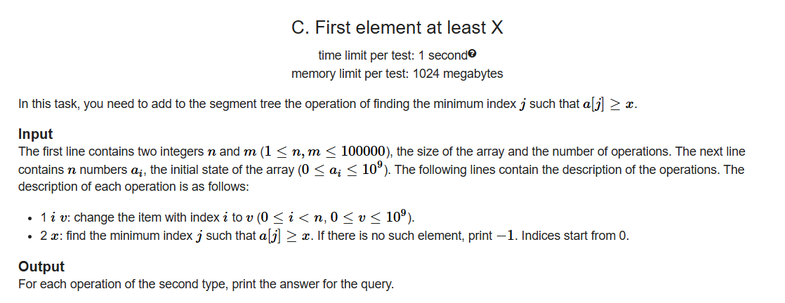
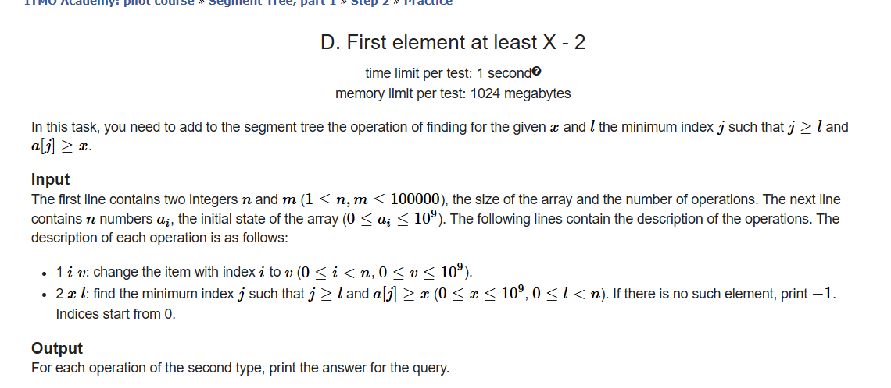

# Segment Tree With Graph : 
```cpp
#define L node*2+1
#define R node*2+2
#define mid ((l+r)/2) 
const int N = 1e5+1 ;
int id ; 
int seg [2][4*N] ; 
vvp adj (8*N);
void build (int l , int r , int node){
    if(l==r){
      seg[0][node] = l ; 
      seg[1][node] = l ;
      return ; 
    }
    seg[0][node] = id++;
    seg[1][node] = id++;
    build(l,mid,L);
    build(mid+1,r,R);
    adj[seg[0][node]].push_back({seg[0][L],0});
    adj[seg[0][node]].push_back({seg[0][R],0});
    adj[seg[1][L]].push_back({seg[1][node],0});
    adj[seg[1][R]].push_back({seg[1][node],0});
}
void conect (int l , int r , int node , int lx , int rx , int tp ,int u , int w){
  if(r<lx || rx<l) return ; 
  if(l>=lx&&r<=rx){
    if(tp==0){
      adj[u].push_back({seg[0][node],w});
    }else{
      adj[seg[1][node]].push_back({u,w});
    }
    return ; 
  }
  conect (l , mid , L , lx , rx , tp , u , w);
  conect (mid+1 , r , R , lx , rx , tp , u , w);
}
int n , q , s ; 
void solve(){
  cin>>n>>q>>s ; 
  id = n ; 
  build(0,n-1,0);

  
  while (q--)
  {
    int t ; cin>>t ; 
    if(t==1){
      int u , v , w ; cin>>u>>v>>w ; 
      u--;v--;
      adj[u].push_back({v,w});
    }else if (t==2){
      int v , l , r , w ; cin>>v>>l>>r>>w;
      l--;r--;v--;
      conect(0,n-1,0,l,r,0,v,w);

    }else{
      int v , l , r , w ; cin>>v>>l>>r>>w;
      l--;r--;v--;
      conect(0,n-1,0,l,r,1,v,w);
    }
  }
  vi dis (8*N,-1);
  vi vis (8*N);
  priority_queue<pair<int,int>,vp,greater<>>pq;
  pq.push({0,s-1});
  
  while (!pq.empty())
  {
    int w = pq.top().first ; 
    int node = pq.top().second ; 
    pq.pop();
    if(vis[node])continue; 
    vis[node]++;
    dis[node]=w ;
    for(auto f : adj[node]){
      if(!vis[f.first]){
        pq.push({f.second +w,f.first });
      }
    }
  }

  lp(i,n){
    cout<<dis[i]<<" " ; 
  }
  cout ln ; 
}
```
---
# Max Subarray Sum SegTree : 
```cpp
struct Segtree
{
 #define L 2*node+1
 #define R 2*node+2
 #define mid ((l+r)/2)
 struct nod
 {
   int mx ; 
   int sum ; 
   int perf ; 
   int suf ; 
 };
 
vector<nod> seg ;
int sz; nod skip ;

nod merge (nod a ,nod b){
   nod ans ; 
   ans.sum = a.sum+b.sum ; 
   ans.perf = max(a.perf , a.sum+b.perf);
   ans.suf  = max(b.suf , b.sum+a.suf);
   ans.mx = max({a.mx,b.mx,a.suf+b.perf,0ll});
   return ans ; 
}
void build (int l , int r , int node , vector<int> & arr){
  if(l==r){
    if(l<arr.size()){
      seg[node].sum += arr[l];
      seg[node].mx = max(arr[l],0ll);
      seg[node].perf = max(arr[l],0ll);
      seg[node].suf = max(arr[l],0ll);
    }
    return;
  }
  build(l,mid,L,arr);
  build(mid+1,r,R,arr);
  seg[node] = merge (seg[L],seg[R]);
}
nod query (int l , int r , int node ,int lx , int rx){
  if(r<lx || rx<l)return skip ;
  if(l>=lx&&r<=rx) return seg[node];
  nod left = query (l , mid ,L , lx , rx);
  nod right= query (mid+1,r,R , lx,rx);
  return merge(left,right);
}
void update (int l , int r, int node , int indx , int val){
  if(l==r){
    seg[node].sum=val;
    seg[node].mx = max(val,0LL);
    seg[node].perf=val;
    seg[node].suf = max(val,0LL);
    return ;
  }
  if(indx<=mid){
    update(l,mid,L,indx,val);
  }
  else{
    update(mid+1,r,R,indx,val);
  }
  seg[node] = merge (seg[L],seg[R]);
}

Segtree(vector<int>&v){
  int n = v.size();
  sz = 1 ;
  nod x  ; 
  x.mx =0 ; x.sum = 0 , x.perf = 0, x.suf = 0;
  skip = x ;
  while (sz<n) sz*=2 ;
  seg  = vector<nod> (sz*2 , skip);
  build(0,sz-1,0,v);
}

nod queryCall(int l , int r){
  return query(0,sz-1,0,l,r);
}
void updateCall(int val , int indx){
  update(0,sz-1,0,indx,val);
}

};
```
---



```cpp
struct Segtree
{
 #define L 2*node+1
 #define R 2*node+2
 #define mid ((l+r)/2)
struct  nod
{
  int val ; 
  int ind ; 
};
vector<nod> seg ;
int sz; nod skip ;
nod merge (nod a ,nod b){
  nod res ; 
  res.val = max(a.val,b.val);
  res.ind = max(a.val,b.val); // not important ;
  return res ;
}
nod query (int l , int r , int node ,int lx , int rx , int x ){
  if(seg[node].val<x){
    nod temp ; 
    temp.val = x , temp.ind = -1 ; 
    return temp ; 
  }
  if(l==r)return seg[node];
  if(seg[L].val>=x){
    return query(l , mid, L,lx,rx,x);
  }else{
    return query(mid+1, r, R,lx,rx,x);
  }
}
void update (int l , int r, int node , int indx , int val){
  if(l==r){
    seg[node].val = val;
    seg[node].ind = indx ; 
    return ;
  }
  if(indx<=mid){
    update(l,mid,L,indx,val);
  }
  else{
    update(mid+1,r,R,indx,val);
  }
  seg[node] = merge (seg[L],seg[R]);
}
Segtree(int szz){
  int n = szz;
  sz = 1 ;
  nod x ; x.ind = 0 ; x.val = 0 ;
  skip = x ;
  while (sz<n) sz*=2 ;
  seg  = vector<nod> (sz*2 , skip);
}

int queryCall(int l , int r , int x){
  return query(0,sz-1,0,l,r ,x).ind;
}
void updateCall(int val , int indx){
  update(0,sz-1,0,indx,val);
}

#undef L
#undef R
#undef mid
};
```
---


```cpp
struct Segtree
{
 #define L 2*node+1
 #define R 2*node+2
 #define mid ((l+r)/2)
struct  nod
{
  int val ; 
  int ind ; 
};

vector<nod> seg ;
int sz; nod skip ;
 nod temp ; 

nod merge (nod a ,nod b){
  nod res ; 
  res.val = max(a.val,b.val);
  if(a.val>b.val){
    res.ind = a.ind;
  }else{
    res.ind = b.ind;
  }
  return res;
}
nod query (int l , int r , int node ,int lx , int rx , int x ){
  if(seg[node].val<x||r<lx){
    return temp ; 
  }
  if(l==r)return seg[node];
 nod left ;

 left = query(l,mid,L,lx,rx,x);
  if(left.ind!=1e14){
    return left;
  }
  return query(mid+1, r, R,lx,rx,x) ;
  
}
void update (int l , int r, int node , int indx , int val){
  if(l==r){
    seg[node].val = val;
    seg[node].ind = indx ; 
    return ;
  }
  if(indx<=mid){
    update(l,mid,L,indx,val);
  }
  else{
    update(mid+1,r,R,indx,val);
  }
  seg[node] = merge (seg[L],seg[R]);
}
Segtree(int szz){
  int n = szz;
  sz = 1 ;
  nod x ; x.ind = 0 ; x.val = 0 ;
  temp.val = 1e9 , temp.ind = 1e14 ; 
  skip = x ;
  while (sz<n) sz*=2 ;
  seg  = vector<nod> (sz*2 , skip);
}

int queryCall(int l , int r , int x){
  return query(0,sz-1,0,l,r ,x).ind;
}
void updateCall(int val , int indx){
  update(0,sz-1,0,indx,val);
}
};
```
---
# DSU Without Small to Larg : 
```cpp
struct Dsu
{
    vector<int> par , sz , pos;
    Dsu (int n){
        for (int i = 0; i <= n; i++)
        {
            sz.push_back(1);
            par.push_back(i);
            pos.push_back(0) ; 
        }
    }
    int find(int u) {
        if (par[u] == u) return u;
        int p = find(par[u]);
        pos[u] += pos[par[u]];  
        return par[u] = p;      
    }
    bool merge (int u , int v){
         u = find(u) ; 
         v = find(v) ; 
        if(u==v)return false ;
        par[u] = v ; 
        pos[u] = pos[v]+1;
        sz[u]+=sz[v];
        return true ; 
    }
};
```
---
# DP Problem For GCD = 1 : 
```cpp
#include <bits/stdc++.h>
using namespace std;

const int N = 3e5 + 7;
const int MOD = 1e9 + 7;

int n;
int countDiv[N];      // countDiv[i] = number of elements divisible by i
int factorial[N];     // factorial[i] = i!
int inverse[N];       // inverse[i] = modular inverse of factorial[i]
int dp[20][N];        // dp[k][i] = number of groups of size k with GCD = i

// Fast exponentiation to compute a^b % MOD
int fast_pow(int a, int b) {
    int result = 1;
    while (b) {
        if (b & 1) result = 1LL * result * a % MOD;
        a = 1LL * a * a % MOD;
        b >>= 1;
    }
    return result;
}

// Compute n choose r modulo MOD
int nCr(int a, int b) {
    if (b < 0 || a < b) return 0;
    return 1LL * factorial[a] * inverse[b] % MOD * inverse[a - b] % MOD;
}

// Subtract under modulo
void mod_subtract(int &a, int b) {
    a -= b;
    if (a < 0) a += MOD;
}

int main() {
    ios::sync_with_stdio(false);
    cin.tie(nullptr);

    // Precompute factorials and their modular inverses
    factorial[0] = 1;
    for (int i = 1; i < N; ++i)
        factorial[i] = 1LL * factorial[i - 1] * i % MOD;

    inverse[N - 1] = fast_pow(factorial[N - 1], MOD - 2);
    for (int i = N - 1; i >= 1; --i)
        inverse[i - 1] = 1LL * inverse[i] * i % MOD;

    // Read input and count frequencies
    cin >> n;
    for (int i = 0; i < n; ++i) {
        int a;
        cin >> a;
        countDiv[a]++;
    }

    // For each i, accumulate counts of all its multiples
    for (int i = 1; i < N; ++i)
        for (int j = i * 2; j < N; j += i)
            countDiv[i] += countDiv[j];

    // Try group sizes from 1 to 19
    for (int groupSize = 1; groupSize < 20; ++groupSize) {
        for (int i = N - 1; i >= 1; --i) {
            // Total ways to choose groupSize elements from numbers divisible by i
            dp[groupSize][i] = nCr(countDiv[i], groupSize);

            // Subtract counts for all multiples of i (Inclusion-Exclusion)
            for (int j = i * 2; j < N; j += i)
                mod_subtract(dp[groupSize][i], dp[groupSize][j]);
        }

        // If there exists at least one group of this size with GCD = 1
        if (dp[groupSize][1] > 0) {
            cout << groupSize << '\n';
            return 0;
        }
    }

    // No valid group found
    cout << -1 << '\n';
    return 0;
}
```
---

# parall Binary Search 1: 
```cpp

struct BIT {
    int n;
    vector<int> bit;

    BIT(int _n) {
        n = _n;
        bit.assign(n + 1, 0); // بنخلي الحجم n+1 عشان نقدر نوصل لـ n-1
    }

    // أضف قيمة عند موقع i
    void add(int i, int val) {
        ++i; // نحوله لـ 1-based داخليًا فقط
        while (i <= n) {
            bit[i] += val;
            i += i & -i;
        }
    }

    // مجموع [0, i]
    int prefixQuery(int i) {
        ++i;
        int res = 0;
        while (i > 0) {
            res += bit[i];
            i -= i & -i;
        }
        return res;
    }

    // مجموع في موقع واحد (بعد rangeAdd)
    int pointQuery(int i) {
        return prefixQuery(i);
    }

    // أضف قيمة لمدى [l, r]
    void rangeAdd(int l, int r, int val) {
        add(l, val);
        add(r + 1, -val);
    }
};

void solve(){
    int n , q ; cin>>n>>q; 
    BIT t1 (n+1);
    vvi adj(n+1) , anc(20,vi(n+1));
    int timer = 0 ; 
    vp arr ; 
    vi in(n+1) , out(n+1) , dis(n+1) , ans(q);
    lp(i,n){
        int a ; cin>>a; 
        arr.push_back({a,i});
    }
    sort(all(arr)) ; 
    for (int i = 0; i < n-1; i++)
    {
        int a , b ; cin>>a>>b;
        adj[a].push_back(b);
        adj[b].push_back(a);
    }

    function<void(int,int)>dfs=[&](int u , int p){
        anc[0][u] = p ;
        in[u] = timer++;
        for(auto f : adj[u]){
            if(f!=p){
                dis[f] = dis[u]+1;
                dfs(f,u);
            }
        }
        out[u] = timer-1;
    };
    dfs(1,0);
    for (int mask = 1; mask < anc.size(); mask++)
    {
        for (int u = 1; u <= n; u++)
        {
        anc[mask][u] = anc[mask-1][anc[mask-1][u]];
        }
    }
    auto getLCA=[&](int u, int v)
    {
        
        if (dis[v] > dis[u]) swap(u, v);

        int diff = dis[u] - dis[v];
        for (int i = 0; diff > 0; ++i) {
            if (diff & 1)
                u = anc[i][u];

            diff >>= 1;
        }

        if (u == v) return u;

        for (int i = anc.size() - 1; i >= 0; --i) {
            if (anc[i][u] != anc[i][v]) {
                u = anc[i][u];
                v = anc[i][v];
            }
        }
        return anc[0][u];
    };
    int ind = -1 ; 
    
    vector<array<int,5>>qi ; 
    for (int i = 0; i < q; i++)
    {
        int u , v , k ; cin>>u>>v>>k;
        qi.push_back({k,u,v,getLCA(u,v),i});
    }
    sort(all(qi)) ; 
    function<void(int,int,vector<int>)>ParallelBS=[&](int l ,int r , vector<int>curQ){
        if(l>r||curQ.empty())return ; 
        if(l==r){
            for(auto indxQury : curQ){
            ans[qi[indxQury][4]]  = arr[l].first ; 
            }
            return;
        }
        int mid = (l+r)/2 ; 
        while (ind<mid)
        {
        ind++;
        int node = arr[ind].second+1 ; 
        t1.rangeAdd(in[node],out[node],1);
        }
        while (ind>mid)
        {
        int node = arr[ind].second+1 ; 
        t1.rangeAdd(in[node],out[node],-1);
        ind--;
        }
        vector<int>lf , ri ; 
        for(auto indxQury : curQ){
            auto [k , u , v , lc , iQ] = qi[indxQury];
            int sum = t1.pointQuery(in[u])+t1.pointQuery(in[v])-t1.pointQuery(in[lc]);
            if(lc!=1)sum-=t1.pointQuery(in[anc[0][lc]]);

            if(sum<k)ri.push_back(indxQury);
            else lf.push_back(indxQury);
        }
        ParallelBS(l , mid , lf);
        ParallelBS(mid+1 ,r , ri);
    };
    vector<int>tmpQ(q);
    for (int i = 0; i < q; i++)
    {
        tmpQ[i] = i ; 
    }
    ParallelBS(0,n-1,tmpQ) ; 
    for (int i = 0; i < q; i++)
    {
        cout<<ans[i] ln ; 
    }
}

```
--- 
# parall Binary Search 2: 

```cpp
int MXN = 1e6+100;
vector<bool>prim(MXN+1,true);
vector<int> allprimes ; 
void sev(){
  for (int i = 2; i <= MXN; i++)
  {
     if(prim[i]){
      allprimes.push_back(i);
      for (int j = i*i; j <= MXN; j+=i)
      {
        prim[j] = false ; 
      }
      
     }
  }
}
struct BIT {
int n;
vector<int> bit;
BIT(int _n) {
    n = _n;
    bit.assign(n + 1, 0); 
}

void add(int i, int val) {
    ++i; 
    while (i <= n) {
        bit[i] += val;
        i += i & -i;
    }
}

int prefixQuery(int i) {
    ++i;
    int res = 0;
    while (i > 0) {
        res += bit[i];
        i -= i & -i;
    }
    return res;
}

int pointQuery(int i) {
    return prefixQuery(i);
}


void rangeAdd(int l, int r, int val) {
    add(l, val);
    add(r + 1, -val);
}
};
void solve(){
  int n , q , timer = 0 ; cin>>n ; 
  vector<vector<int>>adj(n+1) , anc(20,vector<int>(n+1));
  vector<array<int,4>>qi ; 
  vector<int>in(n+1),out(n+1),dis(n+1) ; 
  map<int,vector<int>>mp; 
  for (int i = 0; i < n; i++)
  {
     int a ; cin>>a ; mp[a].push_back(i+1); 
  }
  for (int i = 0; i < n-1; i++)
  {
    int a , b ; cin>>a>>b; 
    adj[a].push_back(b) ; 
    adj[b].push_back(a) ;
  }
  cin>>q ;
  function<void(int,int)>dfs = [&](int u , int p){
      in[u] = timer++;
      anc[0][u] = p ; 
      for(auto f : adj[u]){
          if(f!=p){
            dis[f] = dis[u]+1;
            dfs(f,u);
          }
      }
      out[u] = timer-1;
  };
  dfs(1,0);
  
  for (int mask = 1; mask < 18; mask++)
  {
      for (int u = 1; u <= n; u++)
      {
        anc[mask][u] = anc[mask-1][anc[mask-1][u]];
      }
  }
  auto getLCA = [&](int u, int v)
  {
      
      if (dis[v] > dis[u]) swap(u, v);
      int diff = dis[u] - dis[v];
      for (int i = 0; diff > 0; ++i) {
          if (diff & 1)
              u = anc[i][u];

          diff >>= 1;
      }

      if (u == v) return u;

      for (int i = anc.size() - 1; i >= 0; --i) {
          if (anc[i][u] != anc[i][v]) {
              u = anc[i][u];
              v = anc[i][v];
          }
      }
      return anc[0][u];
  };
  for (int i = 0; i < q; i++)
  {
    int u , v ; cin>>u>>v ; 
    qi.push_back({u,v,getLCA(u,v),i});
  }
  BIT t1 = BIT(n+1) ; 
  vector<int>ans(q);
  int ind = -1 ; 
    function<void(int,int,vector<int>)>parallBS=[&](int l , int r , vector<int>cur){
        if(l>r||cur.empty())return ; 
        if(l==r){
            for(auto indxQury : cur){
            ans[qi[indxQury][3]]  = allprimes[l] ; 
            }
            return;
        }
        int mid = (l+r)/2 ;
        while (mid>ind)
        {
            ind++;
            for(auto ix : mp[allprimes[ind]]){
              t1.rangeAdd(in[ix],out[ix],1);
            }
        }
        while (mid<ind)
        {
          for(auto ix : mp[allprimes[ind]]){
              t1.rangeAdd(in[ix],out[ix],-1);
            }
            ind--;
        }
        vector<int> lf , ri ; 

        for(auto qx : cur){
          auto [u , v , lc , iq] = qi[qx];
          int sum =  t1.pointQuery(in[u])+t1.pointQuery(in[v])-t1.pointQuery(in[lc]);
          if(lc!=1)sum -= t1.pointQuery(in[anc[0][lc]]);
          if(sum<=ind){
            lf.push_back(qx);
          }else{
            ri.push_back(qx);
          }
        }
        parallBS(l , mid , lf);
        parallBS(mid+1 ,r , ri);
  };
  vector<int>tmp(q) ; 
  iota(all(tmp),0);
  parallBS(0 , n+5, tmp);
  
  for (int i = 0; i < q; i++)
  {
    cout<<ans[i] ln ; 
  }
}
int32_t main()
{
  sev();
  KERO
  tc  
    solve();
    return 0;
}
```
---
# Binary Search For In , Out : 
```cpp
void solve(){
    int n ; cin>>n ; 
    vvi adj(n+1) , anc(20 , vi(n+1));
    vvi distarrin(n+1) ;
    
    vi  dis(n+1),in(n+1) , out(n+1);
    int timer = 0 ; 
    for (int i = 0; i < n; i++)
    {
        int a; cin>>a; 
        adj[a].push_back(i+1);
        adj[i+1].push_back(a);
    }
    function<void(int,int)>dfs=[&](int u , int p){
        anc[0][u] = p ;
        in[u] = timer++;
        for(auto f : adj[u]){
            if(f!=p){
                dis[f] = dis[u]+1;
                
                dfs(f,u);
            }
        }
        out[u] = timer-1;
    };
    dfs(0,0);
    for (int mask = 1; mask < 20; mask++)
    {
        for (int u = 1; u <= n; u++)
        {
            anc[mask][u] = anc[mask-1][anc[mask-1][u]];
        }
    }
    auto get_kth_ancestor=[&](int u, int k) {
    for (int i = 0; i < 20; ++i) {
        if (k & (1 << i)) {
            u = anc[i][u];
            if (u == 0) break; 
        }
    }
        return u;
    };
    for (int i = 1; i <= n; i++)
    {
        distarrin[dis[i]].emplace_back(in[i]);
    }
    for (int i = 0; i <= n; i++)
    {
       sort(all(distarrin[i]));
    }
    
    int m ;cin>>m;
    while (m--)
    {
        int a , b ;cin>>a>>b;
        if(b>=dis[a]){cout<<0<<" " ; continue;} 
        int lc = get_kth_ancestor(a,b);
        int d = dis[a];
        if(lc==0){cout<<0<<" " ; continue;} 
        int l = in[lc], r = out[lc];
        int L = lower_bound(distarrin[d].begin(), distarrin[d].end(), l) - distarrin[d].begin();
        int R = upper_bound(distarrin[d].begin(), distarrin[d].end(), r) - distarrin[d].begin();
        int ans = R-L-1;
        cout<<ans<< " ";
    }
 
}
```


# Faris Code : 
```cpp
#include <bits/stdc++.h>
using namespace std;
#include <ext/pb_ds/assoc_container.hpp>
#include <ext/pb_ds/tree_policy.hpp>
using namespace __gnu_pbds;
#define all(v) ((v).begin()), ((v).end())
#define rall(v) ((v).rbegin()), ((v).rend())
#define oo 1e18 + 5
#define MOD ll(1e9 + 7)
#define min3(a, b, c) min(a, min(b, c))
#define max3(a, b, c) max(a, max(b, c))
#define M_PI 3.14159265358979323846
#define int long long
typedef int ll;
typedef vector<ll> vi;
typedef vector<vi> vii;
typedef pair<ll, ll> pi;
typedef vector<pi> vip;
typedef map<ll, ll> mapi;
typedef vector<vip> viip;
typedef tree<pi, null_type, less<pi>, rb_tree_tag, tree_order_statistics_node_update> ordered_set;
ll gcd(ll a, ll b) { return ((b == 0) ? a : gcd(b, a % b)); }
const int N = 1e6 + 10;
///// Agamista
const int M = 30;
ll ansector[N][M];
ll lvl[N];
vii adj;
vii virtualAdj;
int ans = 0;
vi mp;
void dfs(ll node, ll par)
{
    ansector[node][0] = par;
    lvl[node] = lvl[par] + 1;
    for (int i = 1; i < M; ++i)
    {
        ansector[node][i] = ansector[ansector[node][i - 1]][i - 1];
    }
    for (auto ch : adj[node])
    {
        if (ch == par)
            continue;
        dfs(ch, node);
    }
}

ll findKthAncestor(ll u, ll k)
{
    for (int i = M - 1; i >= 0; --i)
    {
        if ((1 << i) & k)
            u = ansector[u][i];
    }
    return u;
}

ll LCA(ll u, ll v)
{
    if (lvl[u] < lvl[v])
        swap(u, v);
    u = findKthAncestor(u, lvl[u] - lvl[v]);
    if (u == v)
        return v;

    for (int i = M - 1; i >= 0; --i)
    {
        if (ansector[u][i] == ansector[v][i])
            continue;
        u = ansector[u][i];
        v = ansector[v][i];
    }
    return ansector[u][0];
}
ll dis(ll u, ll v)
{
    return lvl[u] + lvl[v] - 2 * lvl[LCA(u, v)];
}

vi sub(N, 1), in(N);
void euler(ll node, ll par, ll &time)
{
    in[node] = time++;
    for (auto ch : adj[node])
    {
        if (ch == par)
            continue;
        euler(ch, node, time);
        sub[node] += sub[ch];
    }
}

void buildVirtualTree(vi &nodes, map<int,vector<int>>  &virtualAdj)
{

    if (nodes.empty())
        return;
    stack<ll> stk;
    stk.push(nodes[0]);

    for (int i = 1; i < nodes.size(); i++)
    {
        ll curr = nodes[i];
        ll lca = LCA(stk.top(), curr);

        // Pop nodes that are not ancestors of current node
        while (stk.size() > 1 && lvl[lca] < lvl[stk.top()])
        {
            ll top = stk.top();
            stk.pop();
            virtualAdj[stk.top()].push_back(top);
        }

        // If LCA is different from top of stack
        if (stk.top() != lca)
        {
            ll top = stk.top();
            stk.pop();
            virtualAdj[lca].push_back(top);
            stk.push(lca);
        }

        stk.push(curr);
    }

    // Connect remaining nodes in stack
    while (stk.size() > 1)
    {
        ll top = stk.top();
        stk.pop();
        virtualAdj[stk.top()].push_back(top);
    }
}

int rec(int node, int par, map<int,vector<int>>  &adj)
{
    ll nc = 0;
    for (auto c : adj[node])
    {
        if (c == par)
            continue;
        int me = rec(c, node, adj);
        if(mp[node])
            ans += me * node;
        ans += (me * nc) * node;
        nc += me;
    }
    nc+=mp[node];
    if(mp[node]){
        ans+=node;
        mp[node]=0;
    }
    return nc;
}

void solve()
{
    ll n;
    cin >> n;
    adj.assign(n + 1, {});
    mp.assign(n+1,0);
    for (int i = 0; i < n - 1; i++)
    {
        ll u, v;
        cin >> u >> v;
        adj[u].push_back(v);
        adj[v].push_back(u);
    }
    dfs(1, 0);
    ll time = 0;
    euler(1, -1, time);
    ll q;
    cin >> q;
    while (q--)
    {
        ll k;
        cin >> k;
        vi a(k);
        for (int i = 0; i < k; i++){
            cin >> a[i];
            mp[a[i]]++;
        }

        sort(a.begin(), a.end(), [&](ll u, ll v)
             { return in[u] < in[v]; });

        vi allNodes = a;
        for (int i = 0; i < k - 1; i++)
        {
            ll u = a[i];
            ll v = a[(i + 1)];
            ll l = LCA(u, v);
            allNodes.push_back(l);
        }
        sort(allNodes.begin(), allNodes.end(), [&](ll u, ll v)
             { return in[u] < in[v]; });
        allNodes.erase(unique(allNodes.begin(), allNodes.end()), allNodes.end());
        map<int,vector<int>> tmp;
        buildVirtualTree(allNodes, tmp);
        ans = 0;
        rec(allNodes[0], -1, tmp);
        cout << ans << endl;
    }
}

signed main()
{
    ios_base::sync_with_stdio(0);
    cin.tie(0);
    cout.tie(0);
    ll tc = 1;
    // cin >> tc;
    while (tc--)
    {
        solve();
    }
}
```


---
# Number Theory GCDs Sum * GCDs Length :
```cpp
void solve(){
    int n ; cin>>n ; 
    int arr[n];
    vi freq(N) , divs(N) , dp(N);
    lp(i,n)cin>>arr[i] , freq[arr[i]]++;
    for (int i = 1; i < N; ++i)
        for (int j = i; j < N; j += i)
            divs[i]+=freq[j];

    
    int ans = 0 ;
    for (int g = N; g >= 2 ; g--)
    {
        int cur =(divs[g]*fastPowerMod(2 , divs[g]-1 , mod))%mod;
        for (int i = g*2; i < N; i+=g)
        {
            cur = (cur-dp[i]+mod)%mod;
        }
        dp[g] = cur ; 
        ans = (ans + (cur*g)%mod)%mod ; 
    }
    cout<<ans ln ;
    
}
```

---
# trie problme : 
```cpp
int g = 0 ;
struct Node
{
  map<char,int>mp ;
  int sz = 0 , isEnd = 0; 
  pair<int,int>mx = {0 , 0} ; 
  int &operator[](char x){
    return mp[x];
  }
};
struct Trie
{
  vector<Node>tr ; 
  int newNode (){
    tr.emplace_back();
    return tr.size()-1 ; 
  }
  Trie(){
    tr.clear() ; 
    newNode() ; 
  }
  void insert(string &s , int i = 0 , int cur = 0 ){
      if(i==s.size()){
        tr[cur].isEnd ++;
        tr[cur].mx = min(tr[cur].mx , {-tr[cur].isEnd , -1});
        return ; 
      }
      if(!tr[cur][s[i]]){
        tr[cur][s[i]] = newNode() ; 
      }
      int newcur = tr[cur][s[i]]; 
      tr[cur].sz++;
      insert(s,i+1,newcur);
      tr[cur].mx = min(tr[cur].mx , {tr[newcur].mx.first , s[i]});
  }

  string search (string s){
    
    int cur = 0 ; 
    for(auto ch : s){
      if(tr[cur][ch]==0){
        return "" ; 
      }
      cur = tr[cur][ch] ;
    }
    string res = s ; 
    int f = 0;
    while (f!=-1)
    {
      f = tr[cur].mx.second ; 
      if(f==-1)break;
      cur = tr[cur][f] ;
      res+=f ;
    }
    g = -tr[cur].mx.first ;
    return res ; 
  }
};
```

---
# Ternary Search : 
```cpp
int mn = 0 , mx = 1e10 ; 
    while (mx - mn > 3)
    {
      int md1 = mn + (mx-mn)/3 ; 
      int md2 = mx - (mx-mn)/3 ;
      int c1 = check()  , c2 = check() ;
      res = min({res , c1 , c2}) ;
      if(c1 <= c2){
        mx = md2 ; 
      }else{
        mn = md1 ;
      }
    }

double ternary_search(double l, double r) {
    double eps = 1e-9;              //set the error limit here
    while (r - l > eps) {
        double m1 = l + (r - l) / 3;
        double m2 = r - (r - l) / 3;
        double f1 = f(m1);      //evaluates the function at m1
        double f2 = f(m2);      //evaluates the function at m2
        if (f1 < f2)
            l = m1;
        else
            r = m2;
    }
    return f(l);                    //return the maximum of f(x) in [l, r]
}
```